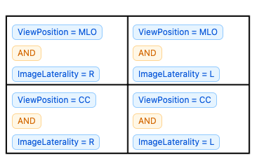
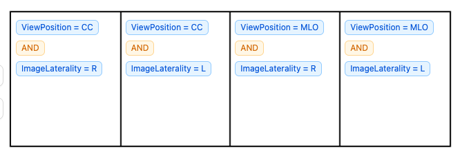
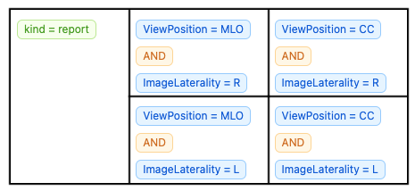
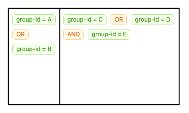

Custom Editor Layouts are uploaded to an Encord Project as JSON files. The following JSON files can be used as examples for some of the most common Label Editor layouts. See [our documentation](https://docs.encord.com/platform-documentation/Annotate/annotate-projects/annotate-manage-annotation-projects#custom-editor-layout) for more information on Custom Editor Layouts. We also provide an [end-to-end example](https://docs.encord.com/end-to-end/custom-editor-layout/editor-layout-clientmetadata) for using Custom Editor layouts based on clientMetadata here.

## [mammo2x2](examples/mammo2x2.json)

## [mammo4x1](examples/mammo4x1.json)

## [mammo2x2-plus-report](examples/mammo2x2-plus-report.json)

## [metadata2x1](examples/metadata2x1.json)

